# Swift Layout x Animation x Transition

2018 - IT 邦棒忙鐵人賽 - [Blog](https://ios.devdon.com/series)

# BankBalance

[Blog](https://ios.devdon.com/archives/922) / [Source Code](https://github.com/slamdon/Swift-Layout-Animation-Transition-30days/tree/master/BankBalance)

# StackViewAnimation

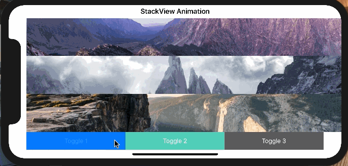

[Blog](https://ios.devdon.com/archives/935) / [Source Code](https://github.com/slamdon/Swift-Layout-Animation-Transition-30days/tree/master/BankBalance)

# DrawingAnimation / CustomLoadingView

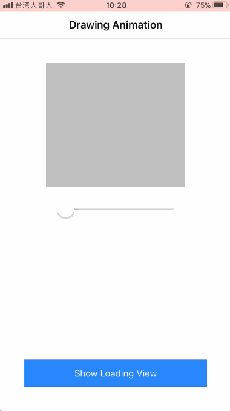

[Blog](https://ios.devdon.com/archives/950) / [SourceCode](https://github.com/slamdon/Swift-Layout-Animation-Transition-30days/tree/master/DrawingAnimation)

# Expandable Buttons

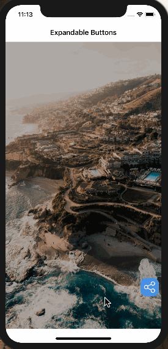

[Blog](https://ios.devdon.com/archives/964) / [Source Code](https://github.com/slamdon/Swift-Layout-Animation-Transition-30days/tree/master/ExpandableButtons)

# Image Slider

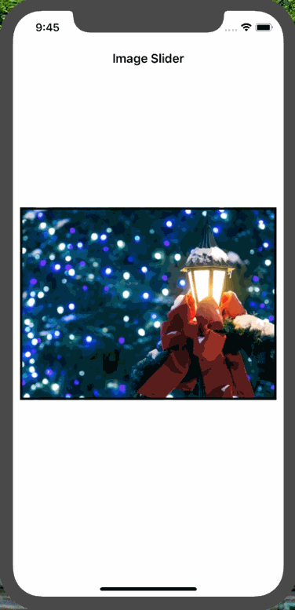

[Blog](https://ios.devdon.com/archives/979) / [Source Code](https://github.com/slamdon/Swift-Layout-Animation-Transition-30days/tree/master/ImageSlider)

# Parallax Scrolling
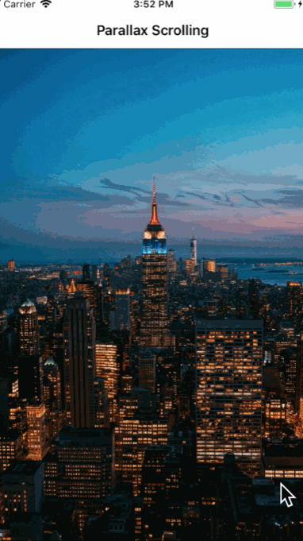

[Blog](https://ios.devdon.com/archives/987) / [Source Code](https://github.com/slamdon/Swift-Layout-Animation-Transition-30days/tree/master/ParallaxScrolling)

# Scratch Card
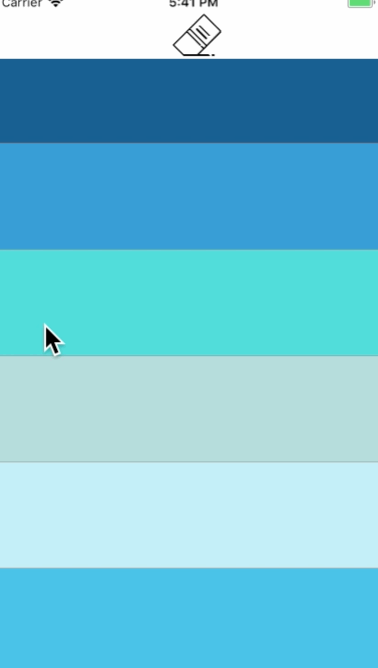

[Blog](https://ios.devdon.com/archives/1006) / [Source Code](https://github.com/slamdon/Swift-Layout-Animation-Transition-30days/tree/master/ScratchCard)

# Flip Card

[Blog](https://ios.devdon.com/archives/1019) / [Source Code](https://github.com/slamdon/Swift-Layout-Animation-Transition-30days/tree/master/FlipCard)

# Image Filter
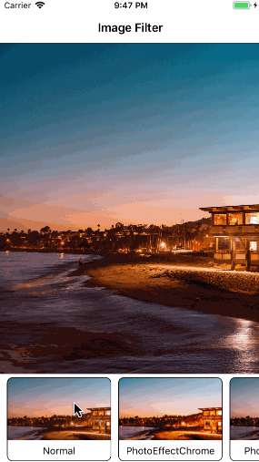

[Blog](https://ios.devdon.com/archives/1036) / [Source Code](https://github.com/slamdon/Swift-Layout-Animation-Transition-30days/tree/master/ImageFilter)

# Merry Christmas - Snow
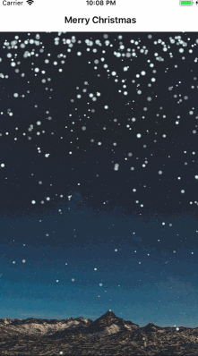

[Blog](https://ios.devdon.com/archives/1046) / [Source Code](https://github.com/slamdon/Swift-Layout-Animation-Transition-30days/tree/master/MerryChristmas)

# LineageM Card Pack Animation - FrameAnimation

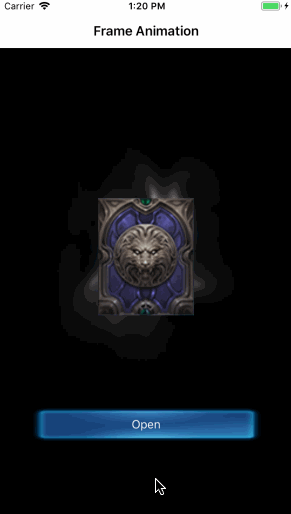

[Blog](https://ios.devdon.com/archives/1062) / [Source Code](https://github.com/slamdon/Swift-Layout-Animation-Transition-30days/tree/master/FrameAnimation)

# LineageM Slot Machine (角子機動畫)

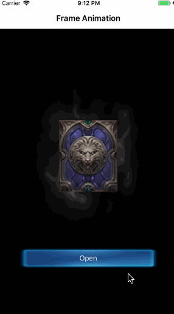

[Blog](https://ios.devdon.com/archives/1076) / [Source Code](https://github.com/slamdon/Swift-Layout-Animation-Transition-30days/tree/master/SlotMachine)

# LineageM Collection
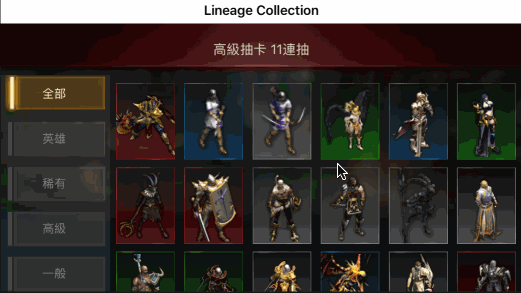

[Blog](https://ios.devdon.com/archives/1108) / [Source Code](https://github.com/slamdon/Swift-Layout-Animation-Transition-30days/tree/master/LineageCollection)

# Card Layout 
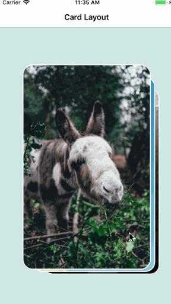

[Blog](https://ios.devdon.com/archives/1120) / [Source Code](https://github.com/slamdon/Swift-Layout-Animation-Transition-30days/tree/master/CardLayout)

# Flat Card Layout
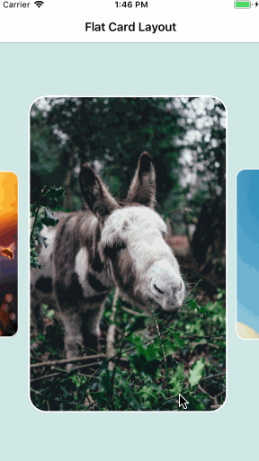

[Blog](https://ios.devdon.com/archives/1132) / [Source Code](https://github.com/slamdon/Swift-Layout-Animation-Transition-30days/tree/master/FlatCardLayout)

# Hotel Card Layout
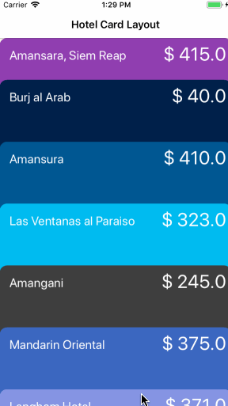

[Blog](https://ios.devdon.com/archives/1142) / [Source Code](https://github.com/slamdon/Swift-Layout-Animation-Transition-30days/tree/master/HotelCardLayout)

# Bank Coins
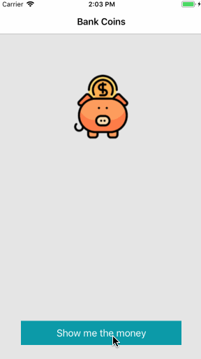

[Blog](https://ios.devdon.com/archives/1156) / [Source Code](https://github.com/slamdon/Swift-Layout-Animation-Transition-30days/tree/master/BankCoins)

# 3DCard Layout
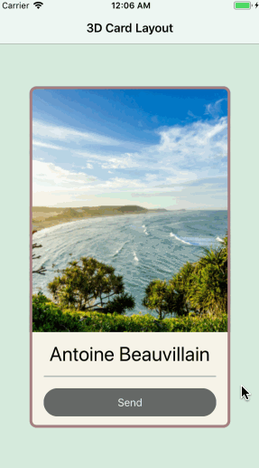

[Blog](https://ios.devdon.com/archives/1167) / [Source Code](https://github.com/slamdon/Swift-Layout-Animation-Transition-30days/tree/master/3DCardLayout)

# Snapshot
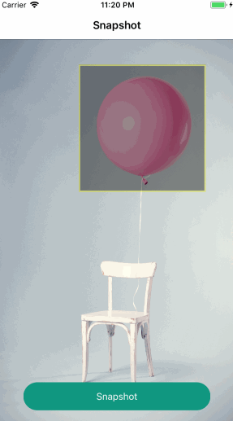

[Blog](https://ios.devdon.com/archives/1178) / [Source Code](https://github.com/slamdon/Swift-Layout-Animation-Transition-30days/tree/master/Snapshot)

# Color Diffusion Transition
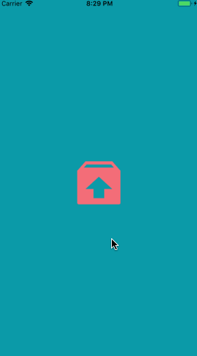

[Blog](https://ios.devdon.com/archives/1185) / [Source Code](https://github.com/slamdon/Swift-Layout-Animation-Transition-30days/tree/master/ColorDiffusionTransition)

# Expand Style Transition

[Blog](https://ios.devdon.com/archives/1192) / [Source Code](https://github.com/slamdon/Swift-Layout-Animation-Transition-30days/tree/master/ExpandTransition)

# Transitions (UIView Transitions)

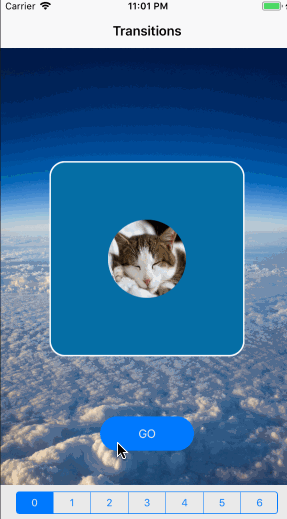

[Blog](https://ios.devdon.com/archives/1207) / [Source Code](https://github.com/slamdon/Swift-Layout-Animation-Transition-30days/tree/master/Transitions)

# Gradient Animation
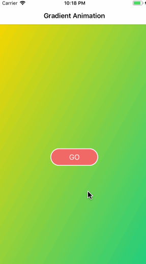

[Blog](https://ios.devdon.com/archives/1217) / [Source Code](https://github.com/slamdon/Swift-Layout-Animation-Transition-30days/tree/master/GradientAnimation)

# Start Page Movie

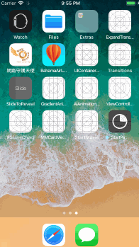

[Blog]() / [Source Code]()